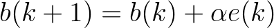

# Perceptrón en Python

Implementación en Python de un Perceptrón clásico.

## Topología de la red

<p align="center">
   
<p>

La topología cuenta con una sola neurona, con vectores de dimensiones Rx1, o con R número de entradas, con SxR número de pesos.
El tamañano del vector bía, es de Sx1.

La salida de la señal n es la suma ponderada de cada elemeto del vector entrada por su peso correspondiente, la bía actúa como otra entrada unitaria con su propio vector de pesos.

La salida a, es la aplicación de la función hardlimit sobre n, que tiene el valor 0 para entradas negativas, y unitarias para el resto.

<p align="center">
   
<p>

## Formulas de la red

<p align="center">
    
</p>
<br>
<p align="center">
    
</p>
<br>
<p align="center">
    
</p>
<br>
<p align="center">
    
</p>

## Algoritmo de aprendizaje

Reglas de actualización de los pesos y bías.

<p align="center">
   
   
<p>

## Instalar dependencias
```shell
$ pip install -r requirements.txt
```

## Módulos utilizados
- matplotlib

## Ejemplo uso

Ejecutamos el scrpit que entrena a la red la función AND, este tiene activada el modo depuración para poder observar los pasos intermedios de entrenamiento.

```shell
$ python3 src/pruebaAND.py

----------------------------
 Vectores(p) y objetivos(t)
----------------------------

  [[0], [0]] => [[0]]
  [[0], [1]] => [[0]]
  [[1], [0]] => [[0]]
  [[1], [1]] => [[1]]

------------------------------
 Entrenamiento del perceptrón
------------------------------

 - Valores iniciales
   w(0) = [[0.19381980397423226], [0.44267258382545305]]
   b(0) = [[0.28011810399127557]]

- Época 1

   + Iteración 1
      a(0) = hardlim(w(0) * p0 + b(0)) = [[1]]
      e(0) = (t(0) - a(0)) = [[-1]]

      Actualizar w y b
      w(1) = w(0) + lr * e(0) * p0 = [[0.19381980397423226], [0.44267258382545305]]
      b(1) = b(0) + lr * e(0) = [[0.08011810399127556]]

   + Iteración 2
      a(1) = hardlim(w(1) * p1 + b(1)) = [[1]]
      e(1) = (t(1) - a(1)) = [[-1]]

      Actualizar w y b
      w(2) = w(1) + lr * e(1) * p1 = [[0.19381980397423226], [0.24267258382545304]]
      b(2) = b(1) + lr * e(1) = [[-0.11988189600872445]]

   + Iteración 3
      a(2) = hardlim(w(2) * p2 + b(2)) = [[1]]
      e(2) = (t(2) - a(2)) = [[-1]]

      Actualizar w y b
      w(3) = w(2) + lr * e(2) * p2 = [[-0.006180196025767748], [0.24267258382545304]]
      b(3) = b(2) + lr * e(2) = [[-0.31988189600872446]]

   + Iteración 4
      a(3) = hardlim(w(3) * p3 + b(3)) = [[0]]
      e(3) = (t(3) - a(3)) = [[1]]

      Actualizar w y b
      w(4) = w(3) + lr * e(3) * p3 = [[0.19381980397423226], [0.44267258382545305]]
      b(4) = b(3) + lr * e(3) = [[-0.11988189600872445]]

- Época 2

   + Iteración 1
      a(4) = hardlim(w(4) * p4 + b(4)) = [[0]]
      e(4) = (t(4) - a(4)) = [[0]]
      w(5) = w(4)
      b(5) = b(4)

   + Iteración 2
      a(5) = hardlim(w(5) * p5 + b(5)) = [[1]]
      e(5) = (t(5) - a(5)) = [[-1]]

      Actualizar w y b
      w(6) = w(5) + lr * e(5) * p5 = [[0.19381980397423226], [0.24267258382545304]]
      b(6) = b(5) + lr * e(5) = [[-0.31988189600872446]]

   + Iteración 3
      a(6) = hardlim(w(6) * p6 + b(6)) = [[0]]
      e(6) = (t(6) - a(6)) = [[0]]
      w(7) = w(6)
      b(7) = b(6)

   + Iteración 4
      a(7) = hardlim(w(7) * p7 + b(7)) = [[1]]
      e(7) = (t(7) - a(7)) = [[0]]
      w(8) = w(7)
      b(8) = b(7)

- Época 3

   + Iteración 1
      a(8) = hardlim(w(8) * p8 + b(8)) = [[0]]
      e(8) = (t(8) - a(8)) = [[0]]
      w(9) = w(8)
      b(9) = b(8)

   + Iteración 2
      a(9) = hardlim(w(9) * p9 + b(9)) = [[0]]
      e(9) = (t(9) - a(9)) = [[0]]
      w(10) = w(9)
      b(10) = b(9)

---------------------------
 Clasificar con perceptrón
---------------------------

  [[0], [0]] => 0
  [[0], [1]] => 0
  [[1], [0]] => 0
  [[1], [1]] => 1
```
Y la representación del borde de decisión.

<p align="center">
   
<p>